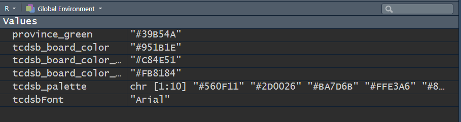

<!-- README.md is generated from README.Rmd. Please edit that file -->

```{r, include = FALSE}
knitr::opts_chunk$set(
  collapse = TRUE,
  comment = "#>",
  fig.path = "man/figures/README-",
  out.width = "100%",
  echo=FALSE, 
  message=FALSE
)
```

# tcdsb

<!-- badges: start -->
[](https://github.com/grousell/tcdsb/actions/workflows/R-CMD-check.yaml)
<!-- badges: end -->

The goal of `tcdsb` is to provide report templates and ggplot themes that align with the visual identity of the Toronto Catholic District School Board. 

## Installation

You can install the development version of tcdsb from [GitHub](https://github.com/) with:

``` r
# install.packages("devtools")
devtools::install_github("grousell/tcdsb")
```

## Plot Example

Here is a basic plot:

```{r basic_plot, echo=TRUE}
library(tidyverse)
library(tcdsb)

mtcars |> 
  head(3) |> 
  rownames_to_column("car") |> 
  ggplot(aes(x = car, y = disp)) +
  geom_col() + 
  labs(title = "Title of Plot", 
       subtitle = "Subtitle", 
       x = NULL, 
       y = "Displacement") 

```

The `tcdsb_colours_fonts` function loads the appropriate fonts and HEX colours. 
```{r colours_fonts, echo=TRUE}
tcdsb_colours_fonts()
```




By adding `tcdsb_ggplot_theme` at the end of the code to build the plot, a consistent theme is applied.

```{r themed_plot,echo=TRUE}

mtcars |> 
  head(3) |> 
  rownames_to_column("car") |> 
  ggplot(aes(x = car, y = disp)) +
  geom_col() + 
  labs(title = "Title of Plot", 
       subtitle = "Subtitle", 
       x = NULL, 
       y = "Displacement") + 
  tcdsb::tcdsb_ggplot_theme()

```

Custom colours can be added to the chart using `tcdsb_board_color`. 

```{r themed_plot2,echo=TRUE}

mtcars |> 
  head(3) |> 
  rownames_to_column("car") |> 
  ggplot(aes(x = car, y = disp)) +
  geom_col(fill = tcdsb_board_color) + 
  labs(title = "Title of Plot", 
       subtitle = "Subtitle", 
       x = NULL, 
       y = "Displacement") + 
  tcdsb::tcdsb_ggplot_theme()

```

## Project Setup Example

```{r project_setup,echo=TRUE}

# tcdsb::tcdsb_project_setup()

```
 Creates a README file and folders for reference documents, R scripts, assets (i.e. image files), raw and clean data. 
