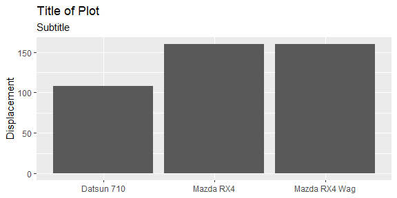
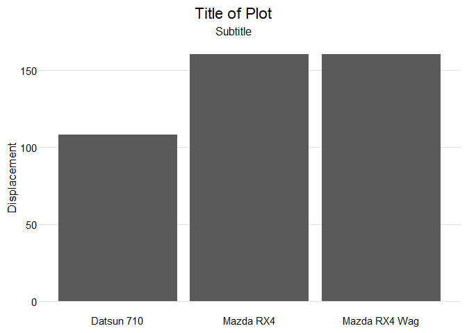
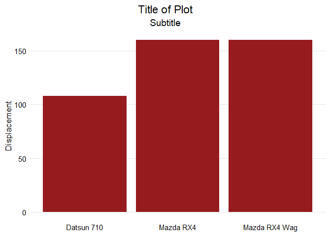

<!-- README.md is generated from README.Rmd. Please edit that file -->

# tcdsb

<!-- badges: start -->

[](https://github.com/grousell/tcdsb/actions/workflows/R-CMD-check.yaml)
<!-- badges: end -->

The goal of `tcdsb` is to provide report templates and ggplot themes
that align with the visual identity of the Toronto Catholic District
School Board.

## Installation

You can install the development version of tcdsb from
[GitHub](https://github.com/) with:

``` r
# install.packages("devtools")
devtools::install_github("grousell/tcdsb")
```

## Example

Here is a basic plot:

``` r
library(tidyverse)
library(tcdsb)

mtcars |> 
  head() |> 
  rownames_to_column("car") |> 
  ggplot(aes(x = car, y = disp)) +
  geom_col() + 
  labs(title = "Title of Plot", 
       subtitle = "Subtitle", 
       x = NULL, 
       y = "Displacement") 
```



The `tcdsb_colours_fonts` function loads the appropriate fonts and HEX
colours.

``` r
tcdsb_colours_fonts()
```


By adding `tcdsb_ggplot_theme` at the end of the code to build the plot,
a consistent theme is applied.

``` r

mtcars |> 
  head() |> 
  rownames_to_column("car") |> 
  ggplot(aes(x = car, y = disp)) +
  geom_col() + 
  labs(title = "Title of Plot", 
       subtitle = "Subtitle", 
       x = NULL, 
       y = "Displacement") + 
  tcdsb::tcdsb_ggplot_theme()
```



Custom colours can be added to the chart using `tcdsb_board_color`.

``` r

mtcars |> 
  head() |> 
  rownames_to_column("car") |> 
  ggplot(aes(x = car, y = disp)) +
  geom_col(fill = tcdsb_board_color) + 
  labs(title = "Title of Plot", 
       subtitle = "Subtitle", 
       x = NULL, 
       y = "Displacement") + 
  tcdsb::tcdsb_ggplot_theme()
```


