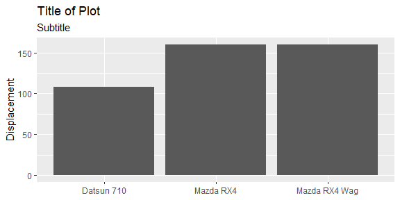
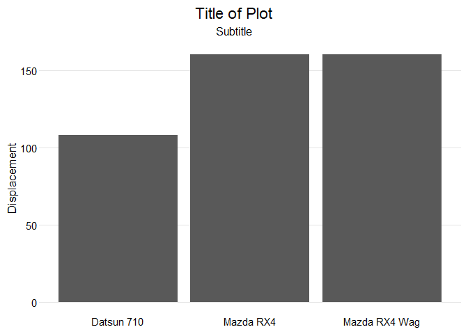
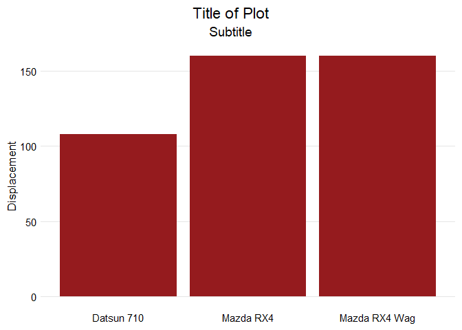

<!-- README.md is generated from README.Rmd. Please edit that file -->

# tcdsb

<!-- badges: start -->

[](https://github.com/grousell/tcdsb/actions/workflows/R-CMD-check.yaml)
<!-- badges: end -->

The goal of `tcdsb` is to provide report templates and ggplot themes
that align with the visual identity of the Toronto Catholic District
School Board (TCDSB).

## Installation

You can install the development version of `tcdsb` from
[GitHub](https://github.com/) with:

``` r
# install.packages("devtools")
devtools::install_github("grousell/tcdsb")
```

## Plot Example

Here is a basic plot:

``` r
library(tidyverse)
library(tcdsb)

mtcars |> 
  head(3) |> 
  rownames_to_column("car") |> 
  ggplot(aes(x = car, y = disp)) +
  geom_col() + 
  labs(title = "Title of Plot", 
       subtitle = "Subtitle", 
       x = NULL, 
       y = "Displacement") 
```



The `tcdsb_colours_fonts` function loads the appropriate fonts and HEX
colours. It is best to assign to an object called `theme` and then call
each color, palette or font.

``` r

theme <- tcdsb::tcdsb_colours_fonts()

theme$tcdsb_board_color
#> [1] "#951B1E"

theme$tcdsb_palette
#>  [1] "#560F11" "#2D0026" "#BA7D6B" "#FFE3A6" "#8EB8C2" "#6BCAD4" "#016567"
#>  [8] "#7DA387" "#8ACA88" "#9D976E"

theme$tcdsb_font
#> [1] "Century Gothic"
```

By adding `tcdsb_ggplot_theme` at the end of the code to build the plot,
a consistent theme is applied.

``` r

mtcars |> 
  head(3) |> 
  rownames_to_column("car") |> 
  ggplot(aes(x = car, y = disp)) +
  geom_col() + 
  labs(title = "Title of Plot", 
       subtitle = "Subtitle", 
       x = NULL, 
       y = "Displacement") + 
  tcdsb::tcdsb_ggplot_theme()
```



Custom colours can be added to the chart using `tcdsb_board_color`.

``` r

mtcars |> 
  head(3) |> 
  rownames_to_column("car") |> 
  ggplot(aes(x = car, y = disp)) +
  geom_col(fill = theme$tcdsb_board_color) + 
  labs(title = "Title of Plot", 
       subtitle = "Subtitle", 
       x = NULL, 
       y = "Displacement") + 
  tcdsb::tcdsb_ggplot_theme()
```



## Project Setup Example

``` r

# tcdsb::tcdsb_project_setup()
```

Creates a README file and folders for reference documents, R scripts,
assets (i.e. image files), raw and clean data.
