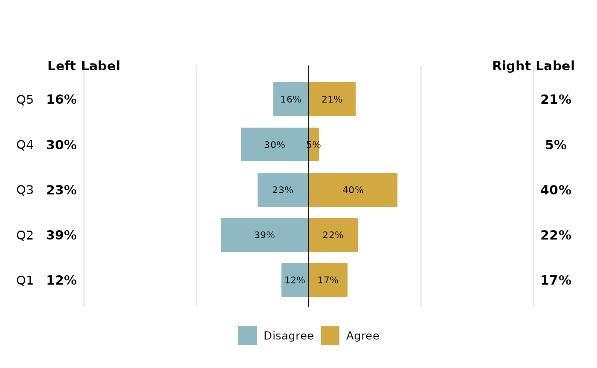
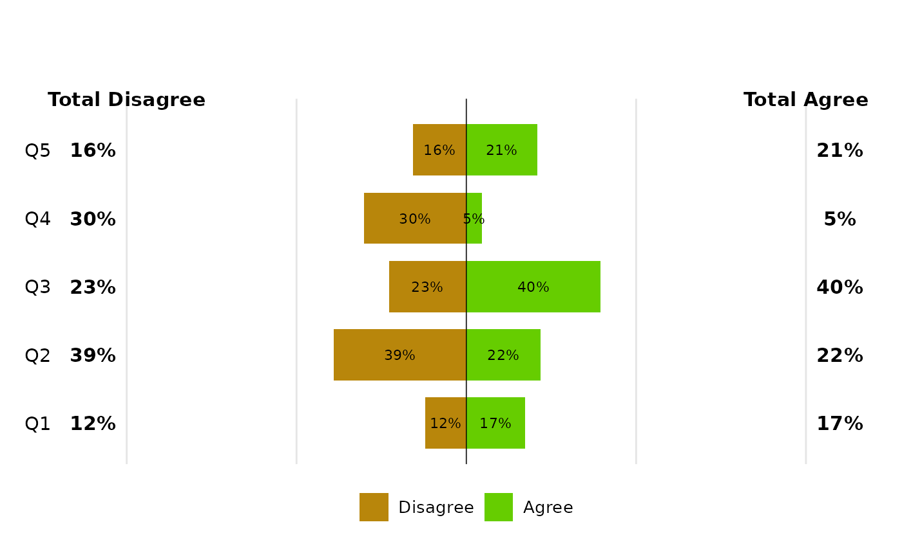
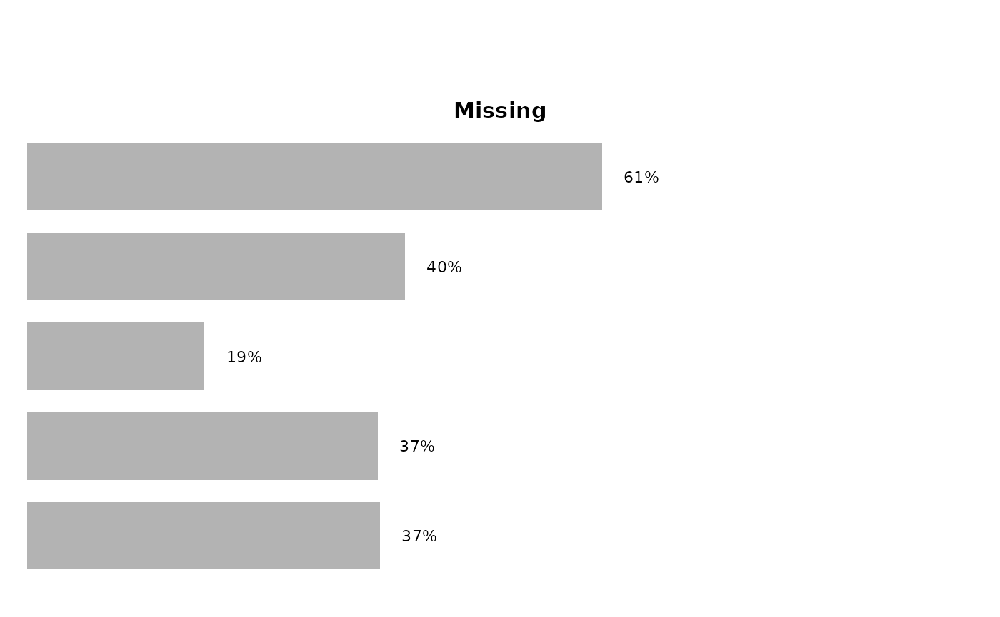
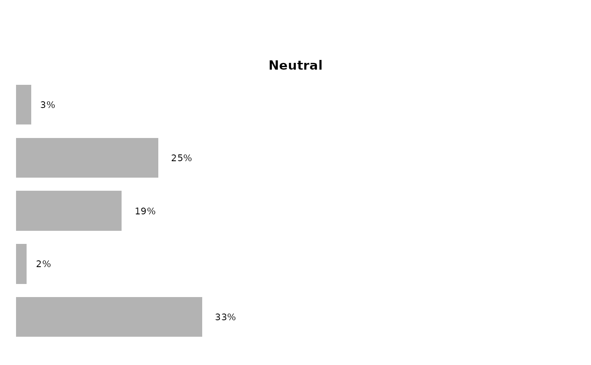
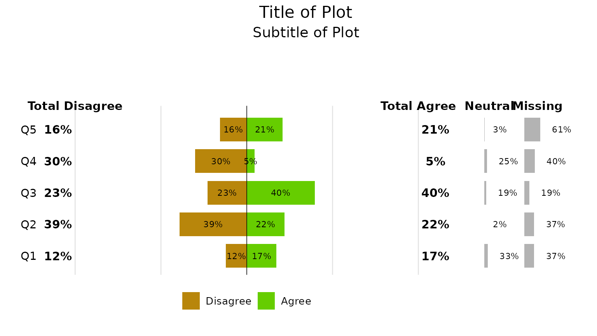
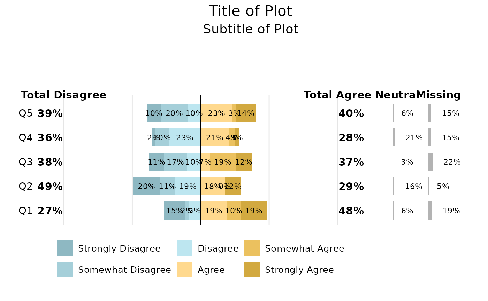

# Diverging Plots

``` r
library(tcdsb)
library(tidyverse)
```

The `tcdsb` package includes 2 functions to create diverging plots to
visualise data that have diverging categories, e.g. survey questions
with response categories like Strongly Disagree -\> Strongly Agree.

The function requires summary data in a long format, with a group column
(i.e. question), response column (i.e. survey responses) and a percent
column.

## Create sample data

The function will take categories with 2, 4 and 6 levels (excluding any
neutral or missing). Here we create a summary table for 6 levels -
Strongly Disagree, Somewhat Disagree, Disagree, Neutral, Agree, Somewhat
Agree, Strongly Agree)

``` r
# Make Dummy Data ----------------------------

set.seed(123)  # For reproducibility

# Function to generate percentages that sum to 100
generate_row <- function(n) {
  probs <- runif(n)
  probs / sum(probs)
}

survey_results_2 <- tibble(
  Question = paste0("Q", 1:5)
  ) |>
  rowwise()  |>
  mutate(
    values = list(generate_row(4)),
    Disagree = values[1],
    Neutral = values[2],
    Agree = values[3],
    Missing = values[4]
    ) |>
  select(-values) |>
  ungroup()|>
  pivot_longer(
    cols = c(`Disagree`:Missing),
    names_to = "response",
    values_to = "percent"
  )

survey_results_4 <- tibble(
  Question = paste0("Q", 1:5)
) |>
  rowwise()  |>
  mutate(
    values = list(generate_row(8)),
    `Strongly Disagree` = values[1],
    Disagree = values[2],
    Neutral = values[3],
    Agree = values[4],
    `Strongly Agree` = values[5],
    Missing = values[6]
  ) |>
  select(-values) |>
  ungroup()|>
  pivot_longer(
    cols = c(`Strongly Disagree`:Missing),
    names_to = "response",
    values_to = "percent"
  )

survey_results_6 <- tibble(
  Question = paste0("Q", 1:5)
) |>
  rowwise()  |>
  mutate(
    values = list(generate_row(8)),
    `Strongly Disagree` = values[1],
    `Somewhat Disagree` = values[2],
    Disagree = values[3],
    Neutral = values[4],
    Agree = values[5],
    `Somewhat Agree` = values[6],
    `Strongly Agree` = values[7],
    Missing = values[8]
  ) |>
  select(-values) |>
  ungroup()|>
  pivot_longer(
    cols = c(`Strongly Disagree`:Missing),
    names_to = "response",
    values_to = "percent"
  )
```

``` r
survey_results_2
#> # A tibble: 20 × 3
#>    Question response percent
#>    <chr>    <chr>      <dbl>
#>  1 Q1       Disagree  0.121 
#>  2 Q1       Neutral   0.333 
#>  3 Q1       Agree     0.173 
#>  4 Q1       Missing   0.373 
#>  5 Q2       Disagree  0.391 
#>  6 Q2       Neutral   0.0189
#>  7 Q2       Agree     0.219 
#>  8 Q2       Missing   0.371 
#>  9 Q3       Disagree  0.228 
#> 10 Q3       Neutral   0.189 
#> 11 Q3       Agree     0.396 
#> 12 Q3       Missing   0.187 
#> 13 Q4       Disagree  0.301 
#> 14 Q4       Neutral   0.254 
#> 15 Q4       Agree     0.0457
#> 16 Q4       Missing   0.399 
#> 17 Q5       Disagree  0.157 
#> 18 Q5       Neutral   0.0268
#> 19 Q5       Agree     0.209 
#> 20 Q5       Missing   0.608
```

``` r
survey_results_4
#> # A tibble: 30 × 3
#>    Question response          percent
#>    <chr>    <chr>               <dbl>
#>  1 Q1       Strongly Disagree  0.156 
#>  2 Q1       Disagree           0.121 
#>  3 Q1       Neutral            0.112 
#>  4 Q1       Agree              0.174 
#>  5 Q1       Strongly Agree     0.115 
#>  6 Q1       Missing            0.124 
#>  7 Q2       Strongly Disagree  0.0674
#>  8 Q2       Disagree           0.0343
#>  9 Q2       Neutral            0.224 
#> 10 Q2       Agree              0.210 
#> # ℹ 20 more rows
```

``` r
survey_results_6
#> # A tibble: 40 × 3
#>    Question response          percent
#>    <chr>    <chr>               <dbl>
#>  1 Q1       Strongly Disagree  0.155 
#>  2 Q1       Somewhat Disagree  0.0220
#>  3 Q1       Disagree           0.0892
#>  4 Q1       Neutral            0.0638
#>  5 Q1       Agree              0.189 
#>  6 Q1       Somewhat Agree     0.104 
#>  7 Q1       Strongly Agree     0.188 
#>  8 Q1       Missing            0.189 
#>  9 Q2       Strongly Disagree  0.197 
#> 10 Q2       Somewhat Disagree  0.109 
#> # ℹ 30 more rows
```

## Generate Plots

Any neutral or missing levels needs to be filtered out from the original
summary data - they are added back in later. Users need to supply the
following arguments:

- `group_col`: Column with group of questions  
- `response_col`: Column response categories  
- `percent_col`: Column with with calculated percent  
- `fct_levels`: List of factor levels

Other arguments that can modified include:

- `font`: Default set to “Century Gothic”  
- `low_colour`: Hex colour for low end of factor levels  
- `high_colour`: Hex colour for high end of factor levels  
- `font_size`: Set to 1, scales the font. (i.e. `font_size` = 1.1
  increases font size by 10%, `font_size` = 0.9 decreases font size by
  10%)  
- `left_label`: String to label left side of plot  
- `right_label`: String to label right side of plot  
- `bar_width`: Width of bars

### Two-Factor Plots

Here we take a summary data frame with 2 factors and apply the
`tcdsb_diverge_plot_function`.

``` r
plot2 <- survey_results_2 |> 
  dplyr::filter(!response %in% c("Missing", "Neutral")) |> 
  tcdsb::tcdsb_diverge_plot_function(
    group_col = Question,                 # Group of questions 
    response_col = response,              # Response categories
    percent_col = percent,                # Column with calculated percent
    fct_levels = c("Disagree", "Agree")   # Factor levels
  )

plot2
```



Here is the same plot, but with additional arguments passed to it

``` r
plot2 <- survey_results_2 |> 
  dplyr::filter(!response %in% c("Missing", "Neutral")) |> 
  tcdsb::tcdsb_diverge_plot_function(
    group_col = Question,                 # Group of questions 
    response_col = response,              # Response categories
    percent_col = percent,                # Column with calculated percent
    fct_levels = c("Disagree", "Agree"),  # Factor levels
    left_label = "Total Disagree", 
    right_label = "Total Agree", 
    low_colour = "darkgoldenrod", 
    high_colour = "chartreuse3"
  )
plot2
```



The second function is the `tcdsb_diverge_plot_other_function`. This
creates a separate bar for neutral, or missing categories.

``` r
plot2_missing <- survey_results_2 |> 
  dplyr::filter(response == "Missing") |> 
  tcdsb::tcdsb_diverge_plot_other_function(
    group_col = Question, 
    response_col = response,
    percent_col = percent, 
    label = "Missing"
  )

plot2_neutral <- survey_results_2 |> 
  dplyr::filter(response == "Neutral") |> 
  tcdsb::tcdsb_diverge_plot_other_function(
    group_col = Question, 
    response_col = response,
    percent_col = percent, 
    label = "Neutral"
  )
```

``` r
plot2_missing
```



``` r
plot2_neutral
```



Finally, using the `patchwork` package, we can stitch them all together
into a single plot.

``` r
library(patchwork)

(plot2 + plot2_neutral + plot2_missing ) + 
  plot_layout(widths = c(4, 0.1, 0.25, 0.25)) +
    plot_annotation(
      title = "Title of Plot",
      subtitle = "Subtitle of Plot",
      theme = theme(
        plot.title = element_text(
          hjust = 0.5, # Centers the title
          family = "Century Gothic", # Specifies the font family
          size = 16, # Adjusts font size
          color = "black" # Sets font color
        ),
        plot.subtitle = element_text(
          hjust = 0.5, # Centers the title
          family = "Century Gothic", # Specifies the font family
          size = 14, # Adjusts font size
          color = "black" # Sets font color
        ),
        legend.position = "bottom",
        legend.justification = "left",
        legend.box.just = "left"
      )
    )
```



### Four-Factor Plot

``` r
plot4 <- survey_results_4 |> 
  dplyr::filter(!response %in% c("Missing", "Neutral")) |> 
  tcdsb::tcdsb_diverge_plot_function(
    group_col = Question,                 # Group of questions 
    response_col = response,              # Response categories
    percent_col = percent,                # Column with calculated percent
    fct_levels = c("Strongly Disagree", "Disagree", "Agree", "Strongly Agree"),  # Factor levels
    left_label = "Total Disagree", 
    right_label = "Total Agree"
    )

plot4_missing <- survey_results_4 |> 
  dplyr::filter(response == "Missing") |> 
  tcdsb::tcdsb_diverge_plot_other_function(
    group_col = Question, 
    response_col = response,
    percent_col = percent, 
    label = "Missing"
  )

plot4_neutral <- survey_results_4 |> 
  dplyr::filter(response == "Neutral") |> 
  tcdsb::tcdsb_diverge_plot_other_function(
    group_col = Question, 
    response_col = response,
    percent_col = percent, 
    label = "Neutral"
  )

(plot4 + plot4_neutral + plot4_missing ) + 
  plot_layout(widths = c(4, 0.1, 0.25, 0.25)) +
    plot_annotation(
      title = "Title of Plot",
      subtitle = "Subtitle of Plot",
      theme = theme(
        plot.title = element_text(
          hjust = 0.5, # Centers the title
          family = "Century Gothic", # Specifies the font family
          size = 16, # Adjusts font size
          color = "black" # Sets font color
        ),
        plot.subtitle = element_text(
          hjust = 0.5, # Centers the title
          family = "Century Gothic", # Specifies the font family
          size = 14, # Adjusts font size
          color = "black" # Sets font color
        ),
        legend.position = "bottom",
        legend.justification = "left",
        legend.box.just = "left"
      )
    )
```


### Six-Factor Plot

``` r
plot6 <- survey_results_6 |> 
  dplyr::filter(!response %in% c("Missing", "Neutral")) |> 
  tcdsb::tcdsb_diverge_plot_function(
    group_col = Question,                 # Group of questions 
    response_col = response,              # Response categories
    percent_col = percent,                # Column with calculated percent
    fct_levels = c("Strongly Disagree", "Somewhat Disagree", "Disagree", "Agree", "Somewhat Agree", "Strongly Agree"),  # Factor levels
    left_label = "Total Disagree", 
    right_label = "Total Agree"
    )

plot6_missing <- survey_results_6 |> 
  dplyr::filter(response == "Missing") |> 
  tcdsb::tcdsb_diverge_plot_other_function(
    group_col = Question, 
    response_col = response,
    percent_col = percent, 
    label = "Missing"
  )

plot6_neutral <- survey_results_6 |> 
  dplyr::filter(response == "Neutral") |> 
  tcdsb::tcdsb_diverge_plot_other_function(
    group_col = Question, 
    response_col = response,
    percent_col = percent, 
    label = "Neutral"
  )

(plot6 + plot6_neutral + plot6_missing ) + 
  plot_layout(widths = c(4, 0.1, 0.25, 0.25)) +
    plot_annotation(
      title = "Title of Plot",
      subtitle = "Subtitle of Plot",
      theme = theme(
        plot.title = element_text(
          hjust = 0.5, # Centers the title
          family = "Century Gothic", # Specifies the font family
          size = 16, # Adjusts font size
          color = "black" # Sets font color
        ),
        plot.subtitle = element_text(
          hjust = 0.5, # Centers the title
          family = "Century Gothic", # Specifies the font family
          size = 14, # Adjusts font size
          color = "black" # Sets font color
        ),
        legend.position = "bottom",
        legend.justification = "left",
        legend.box.just = "left"
      )
    )
```


